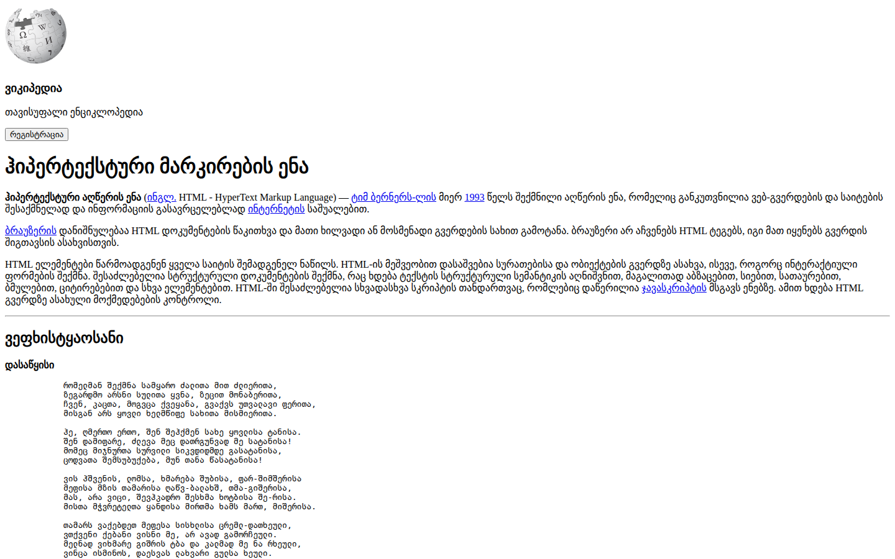

# Web Development — HTML Lesson Page (Georgian)

A Georgian-language lesson page that introduces HTML (ჰიპერტექსტური მარკირების ენა), styled like an encyclopedia article, with embedded video and audio.

## What's inside

- Article layout with headings, links, and paragraphs
- Embedded YouTube video and audio element

## Built with

- HTML
- CSS

## Run locally

No build step. Open `index.html` in a browser.
